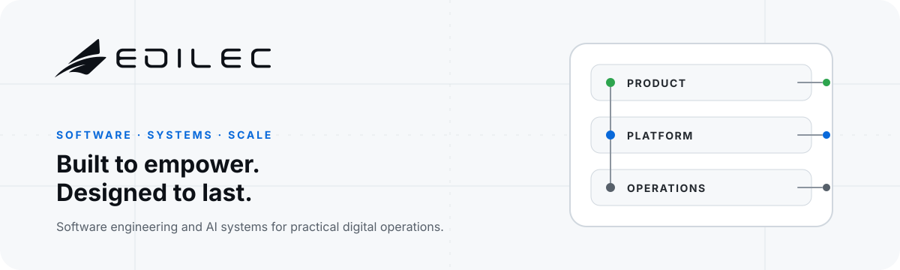

  <picture>
    <source media="(prefers-color-scheme: dark)" srcset="./assets/profile/edilec-hero-dark.svg">
    
  </picture>

  <a href="https://edilec.com/"><strong>Website</strong></a> ·
  <a href="https://edilec.com/services/">Services</a> ·
  <a href="https://edilec.com/products/">Products</a> ·
  <a href="https://edilec.com/blog/">Engineering library</a> ·
  <a href="https://edilec.com/security/">Security</a> ·
  <a href="https://edilec.com/contact/">Contact</a>

Edilec Private Limited builds practical software, AI workflow, cloud, data, identity, security, and product systems. We work from clear ownership and system boundaries toward software that can be tested, operated, and improved.

## What Edilec builds

- **Custom software and product engineering** — web applications, platforms, APIs, and internal systems shaped around real operating work.
- **AI-assisted workflow systems** — automation with explicit inputs, approvals, failure paths, and human accountability.
- **Cloud and DevOps platforms** — deployment, delivery, observability, and operational controls for maintainable services.
- **Identity and security systems** — authentication, authorization, auditability, and responsible data boundaries.
- **Data and reporting infrastructure** — integrations, reporting paths, and decision-ready operational data.
- **Developer platforms and integrations** — tools and service connections that reduce repeated engineering work.

## Products and current work

### [Uynis](https://edilec.com/products/uynis/) · active development

An Edilec product platform under active development. Public material describes the product direction; its public source is not presented as a production-ready release.

### Edilec Mail · private development

A privately developed mail and customer-communication system. Its source repository and deployment details are not public, and no public-release claim is made here.

## Maintained open source

### [Sitemap Cohort Auditor](https://github.com/edilec/sitemap-cohort-auditor)

Audit sitemap declarations and compare exact URL cohorts between releases with a dependency-free Node.js CLI. It audits declared sitemap data; it does not crawl listed pages or predict indexing, rankings, or traffic.

**v0.2.1** · **Node.js 20+** · **MIT** · CLI

[Documentation](https://github.com/edilec/sitemap-cohort-auditor#readme) · [Release v0.2.1](https://github.com/edilec/sitemap-cohort-auditor/releases/tag/v0.2.1) · [Automated checks](https://github.com/edilec/sitemap-cohort-auditor/actions) · [Security](https://github.com/edilec/sitemap-cohort-auditor/security/policy) · [Contribute](https://github.com/edilec/sitemap-cohort-auditor/blob/main/CONTRIBUTING.md)

### [inline-json-for-html](https://github.com/edilec/inline-json-for-html)

Serialize JSON for the raw text of `<script type="application/json">` elements
with a small dependency-free utility and TypeScript declarations. It is not for
executable JavaScript or general HTML sanitization.

**v0.1.1** · **Node.js 22+** · **MIT** · JavaScript library

[Documentation](https://github.com/edilec/inline-json-for-html#readme) · [Release v0.1.1](https://github.com/edilec/inline-json-for-html/releases/tag/v0.1.1) · [Automated checks](https://github.com/edilec/inline-json-for-html/actions) · [Security](https://github.com/edilec/inline-json-for-html/security/policy) · [Contribute](https://github.com/edilec/inline-json-for-html/blob/main/CONTRIBUTING.md)

## How Edilec engineers software

- Define ownership, interfaces, and failure boundaries before scaling a system.
- Treat security and privacy as design inputs, not release-stage additions.
- Prefer reproducible builds, automated checks, and evidence over unsupported claims.
- Keep changes reviewable and make operational consequences visible.
- Design for observability, recovery, and maintainable handover.
- Record architecture decisions, maturity, limitations, and non-goals explicitly.
- Use automation to support accountable engineering—not to obscure responsibility.
- Maintain open-source work with clear scope, support expectations, and disclosure paths.

## Documentation and research

- [Engineering library](https://edilec.com/blog/) — practical writing across software, AI, cloud, data, security, and product work.
- [Products](https://edilec.com/products/) — current Edilec product directions and public product information.
- [Services](https://edilec.com/services/) — engineering capabilities and engagement areas.
- [Authors](https://edilec.com/authors/) — the people and teams responsible for Edilec's published work.

## Security and contributing

For a repository vulnerability, follow that repository's `SECURITY.md` and avoid disclosing unresolved security issues in a public issue. For company or website security concerns, use the [Edilec security page](https://edilec.com/security/) or email [hello@edilec.com](mailto:hello@edilec.com).

Contributions should begin with the affected repository's contribution guide and issue tracker. Scope, compatibility, tests, documentation, and security impact should be clear before a change is merged.

## Company and maintainers

**Edilec Private Limited** is led by [Krishnam Murarka](https://github.com/KRISHNAMMurarka), Founder and CEO. Krishnam contributes to and maintains Edilec's public engineering work.

For project planning or commercial enquiries, visit [edilec.com/contact](https://edilec.com/contact/) or email [hello@edilec.com](mailto:hello@edilec.com).
