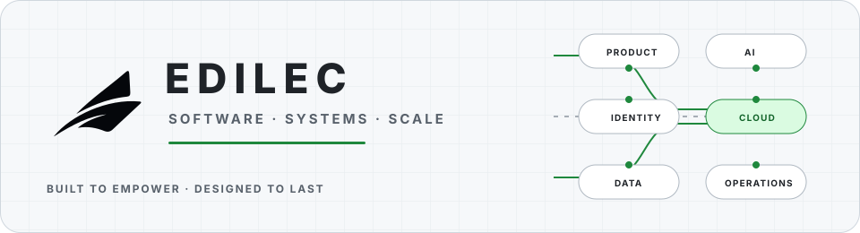

  <picture>
    <source media="(prefers-color-scheme: dark)" srcset="./assets/brand/edilec-systems-dark.svg">
    <source media="(prefers-color-scheme: light)" srcset="./assets/brand/edilec-systems-light.svg">
    
  </picture>

<h1 align="center">Edilec</h1>

  <strong>Software. Systems. Scale.</strong> 
  Practical software engineering, AI workflow, cloud, data, identity, security, and product systems.

  <a href="https://edilec.com/">Website</a> &nbsp;·&nbsp;
  <a href="https://edilec.com/products/">Products</a> &nbsp;·&nbsp;
  <a href="https://edilec.com/blog/">Engineering library</a> &nbsp;·&nbsp;
  <a href="https://edilec.com/security/">Security</a> &nbsp;·&nbsp;
  <a href="https://edilec.com/contact/">Contact</a>

  <code>Product engineering</code> &nbsp;
  <code>AI workflows</code> &nbsp;
  <code>Cloud &amp; DevOps</code> &nbsp;
  <code>Identity &amp; security</code> &nbsp;
  <code>Data systems</code>

---

## Maintained open source

> ### [Sitemap Cohort Auditor →](https://github.com/edilec/sitemap-cohort-auditor)
> Exact sitemap declaration and URL-cohort comparison between releases.
>
> `Node.js 20+` · `v0.2.1` · `MIT` · `maintained` 
> [Release](https://github.com/edilec/sitemap-cohort-auditor/releases/tag/v0.2.1) · [Security](https://github.com/edilec/sitemap-cohort-auditor/security/policy)

> ### [inline-json-for-html →](https://github.com/edilec/inline-json-for-html)
> Narrow JSON serialization for the raw text of HTML script elements; not a general HTML sanitizer.
>
> `Node.js 22+` · `v0.1.1` · `MIT` · `maintained` 
> [Release](https://github.com/edilec/inline-json-for-html/releases/tag/v0.1.1) · [Security](https://github.com/edilec/inline-json-for-html/security/policy)

> ### [SVG Semantic Layout Auditor →](https://github.com/edilec/svg-semantic-layout-auditor)
> Static accessibility, reference-safety, dimension, and text-layout checks for SVG libraries.
>
> `Node.js 20+` · `v0.1.0` · `MIT` · `release candidate` 
> [Rules](https://github.com/edilec/svg-semantic-layout-auditor/blob/main/docs/rules.md) · [Security](https://github.com/edilec/svg-semantic-layout-auditor/security/policy)

> ### [Content Identity Auditor →](https://github.com/edilec/content-identity-auditor)
> Content-ID collision, canonical identity, and publication-cadence auditing with deterministic JSON reports.
>
> `Node.js 22+` · `v0.1.0` · `MIT` · `experimental` 
> [Release](https://github.com/edilec/content-identity-auditor/releases/tag/v0.1.0) · [Security](https://github.com/edilec/content-identity-auditor/security/policy)

## Open-source engineering evidence

  <picture>
    <source media="(prefers-color-scheme: dark) and (max-width: 600px)" srcset="https://raw.githubusercontent.com/edilec/edilec/metrics-renders/assets/metrics/engineering-signal-mobile-dark.svg">
    <source media="(max-width: 600px)" srcset="https://raw.githubusercontent.com/edilec/edilec/metrics-renders/assets/metrics/engineering-signal-mobile-light.svg">
    <source media="(prefers-color-scheme: dark)" srcset="https://raw.githubusercontent.com/edilec/edilec/metrics-renders/assets/metrics/engineering-signal-dark.svg">
    
  </picture>

## Product direction

> **[Uynis](https://edilec.com/products/uynis/)** is under active development.
> Public material describes its direction; Edilec does not present its public
> source as a production-ready release.

## How Edilec engineers

- One canonical repository and a named maintainer for each public project.
- Explicit maturity, support boundaries, limitations, and non-goals.
- Security and privacy reviewed before release, with private disclosure routes.
- Reproducible checks and release evidence before readiness or performance claims.
- Small, reviewable changes with observable operations and recovery guidance.

## Company and maintainer

**Edilec Private Limited** is led by
[Krishnam Murarka](https://github.com/KRISHNAMMurarka), Founder and CEO.

For a repository vulnerability, follow its `SECURITY.md` rather than opening a
public issue. For company or website security concerns, use the
[Edilec security page](https://edilec.com/security/) or email
[hello@edilec.com](mailto:hello@edilec.com).

<strong>Built to empower. Designed to last.</strong>

